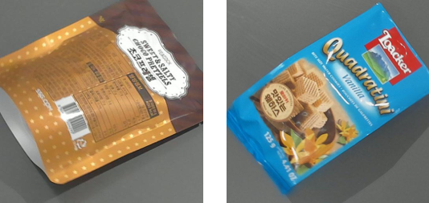

# Retail-71 dataset for Domain Adaptation
We introduce Retail-71 whose source domain contains clean images of diverse products commonly seen in market or convenience store, while its target domain broods images in which hand occlusion and motion blur exist. The domain shift between source and target domain is mainly from hand occlusion and motion blur, as well as a difference in background, resolution, lighting, device used to collect images, and so on.

Unlike other existing benchmarks, Retail-71 includes its test set with three difficulties, i.e. easy, medium, and hard level. Harder test set contains the test samples with more intensified motion blur and hand occlusion.

## Some examples of source-domain images


## Some examples of target-domain images


# Download
You can download Retail-71: [Link](https://drive.google.com/file/d/1ySCLGlJ9KEo2dOTIpFs_kpFfI_pf1E8v/view?usp=sharing) (about 18.27GB).

When it comes to source domain, this dataset includes not only plain version (denoted as 0) but also augmented versions (denoted as 1, 2, 3, 4, 01, 02, ..., 0134, 01234) by rule-based synthesis (RS) .
Note that target domain is NOT augmented by RS.

The meaning of number code in denotations of augmented versions is as follows.
- 0 means O: original source-domain dataset (i.e., no RS is applied)
- 1 means E: intermediate-domain dataset generated by RS with easy difficulty
- 2 means M: intermediate-domain dataset generated by RS with medium difficulty
- 3 means MP: intermediate-domain dataset generated by RS with medium difficulty and zero padding
- 4 means H: intermediate-domain dataset generated by RS with hard difficulty
- The multi-digit indicates the multiple intermediate datasets corresponding to the digits are mixed. Some examples are as follows.
  - 013 means the mixture of O, E, and MP.
  - 02 means the mixture of O and M 

The structure of Retail-71 is as follows.

```bash
Retail-71
|_ retail71  # train set
|  |_ 0  # O: dataset with original source-domain dataset
|  |  |_ train  # source domain
|  |  |  |_ 001  # class folder
|  |  |  |  |_ <name_image1>.jpg
|  |  |  |  |_ <name_image2>.jpg
|  |  |  |  ...
|  |  |  |  |_ <name_imageN>.jpg
|  |  |  |_ 002
|  |  |  ...
|  |  |  |_ 071
|  |  |  |_ train_image_list.txt
|  |  |_ validation  # target domain
|  |  |  |_ 001  # class folder
|  |  |  |_ 002
|  |  |  ...
|  |  |  |_ 071
|  |  |  |_ valid_image_list.txt
|  |  |_ category.txt
|  |_ 1  # E: Its source-domain dataset is an intermediate-domain dataset generated by RS with EASY difficulty
|  |_ 2  # M: Its source-domain dataset is an intermediate-domain dataset generated by RS with MEDIUM difficulty
|  |_ 3  # MP: Its source-domain dataset is an intermediate-domain dataset generated by RS with MEDIUM difficulty and zero padding
|  |_ 4  # H: Its source-domain dataset is an intermediate-domain dataset generated by RS with HARD difficulty
|  ...
|  |_ 0134  # Its source-domian dataset is the mixture of O, E, MP, and H
|  |_ 01234  # Its source-domain dataset is the mixture of O, E, M, MP, and H
|_ test  # test set
|  |_ 1  # difficulty: easy
|  |  |_ train  # It is an empty folder
|  |  |_ validation  # Test samples are here.
|  |  |_ category.txt
|  |_ 2  # difficulty: medium
|  |_ 3  # difficulty: hard
```

# License
This dataset can only be used for scientific/non-commercial purposes. If you use this dataset in your research, please cite the corresponding paper (link will be added later).
